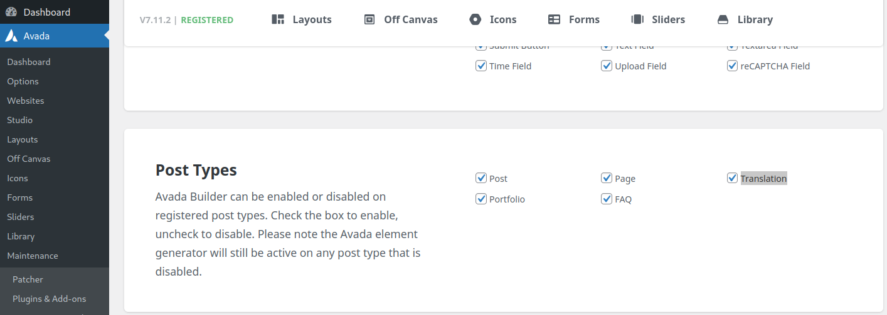
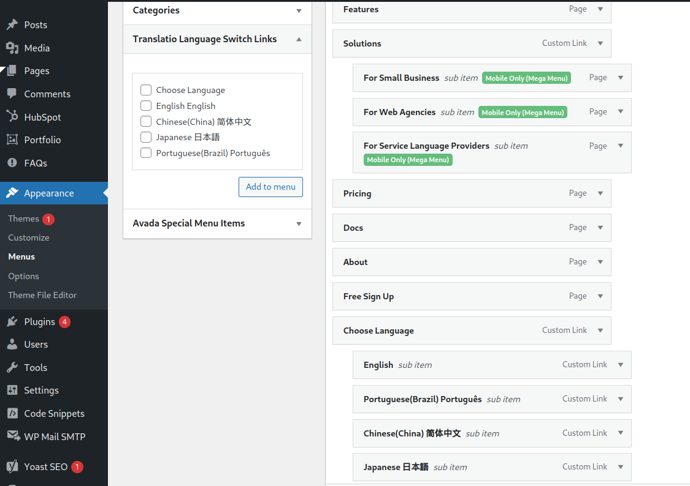
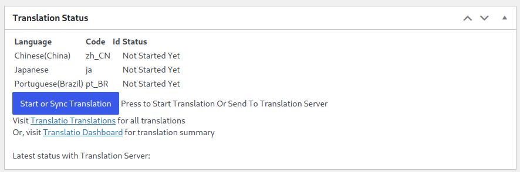
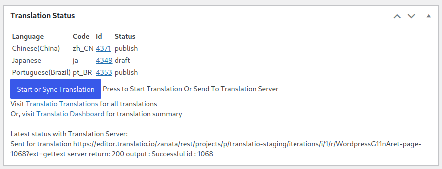
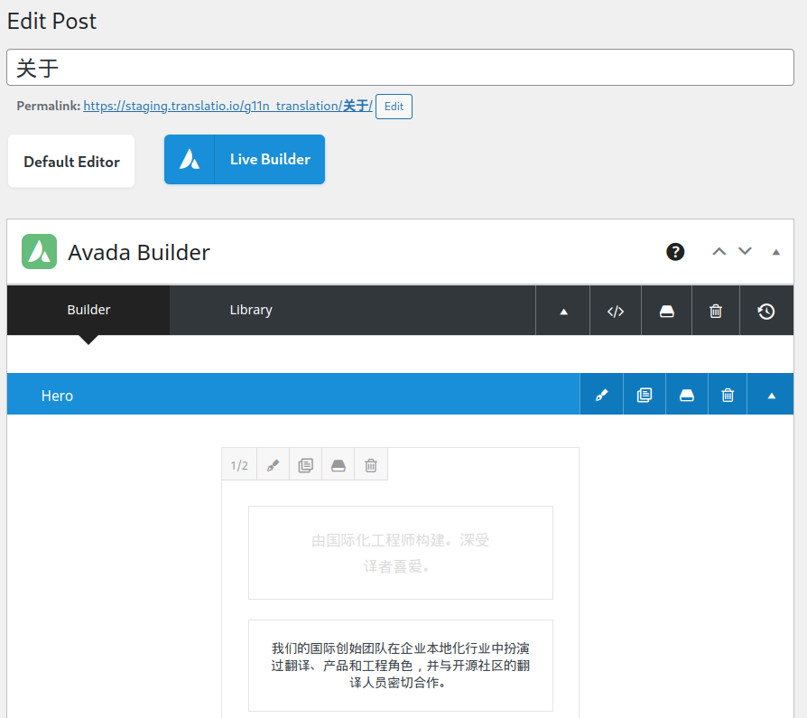
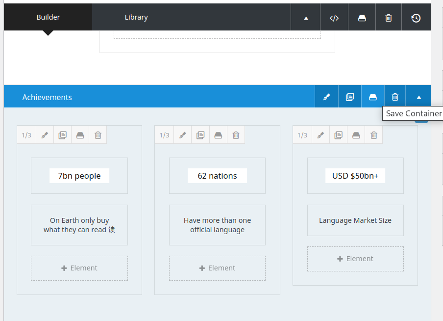
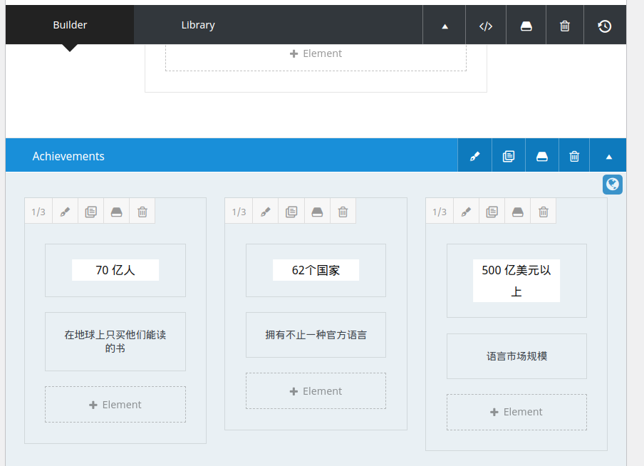

# Translatio plugin for WordPress Themes Started & FAQ

----

Translatio is an open source tool for internationalization and localization of WordPress based websites. Here are guide to use it with different wordpress themes

----

## Avada

- Avada version tested: V7.11.2

- After Avada is installed, enable it with Translatio plugin by Avada Dashboard -> Options -> Builder Options, then scroll down to the "Post Types" section, enable Translation by click it and save the changes.

  <kbd></kbd>

- Setup language switcher menu
  From "Appearance" -> "Menu", choose the menu you want to add langauge switcher, then add from Translatio preset menu items 
  <kbd></kbd>
  
- Translating "About" Page

  - Load the page in Wordpress Dashboard, follow Pages -> All Pages, then choose "About".
  - Scroll down to find the "Translation Status" box like following, then click button "Start or Sync Translation"
    <kbd></kbd>
  - Once the Id is shown up in each Language, click it to edit the language Translation Page
    <kbd></kbd>
  - Fill in the translation in the language page and Publish 
    <kbd></kbd>
  - Done
   
- Translating Avada Global container
  - If you use Avada Global container, edit the container in Avada -> Library or click the "Save Container" then click "Edit" butto of the global container button 
    <kbd></kbd>
  - Start the translation the same way in the Translation Status like you are tranlating a normal page
  - In the page that uses the global container, translated page will shown up automatically, then save and publish 
    <kbd></kbd>
  - Done

- Translating Other Avada Element
  - Translatio supports Avada elements:
    - Header and Footer

